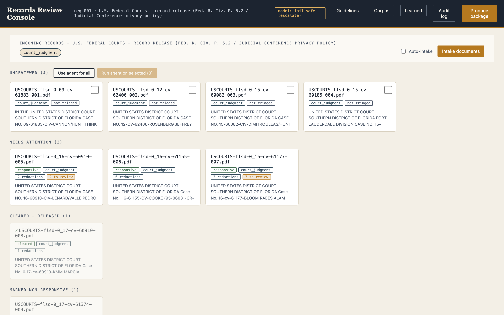
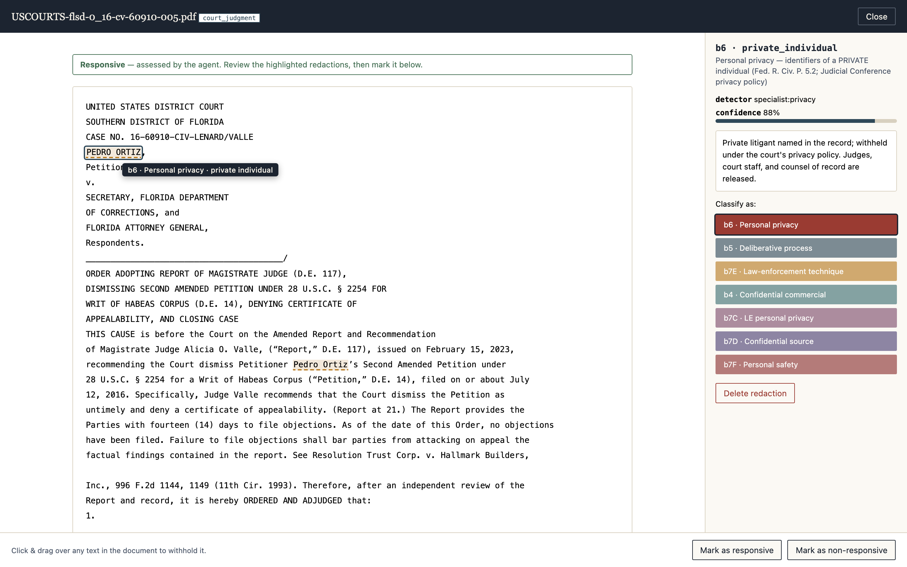
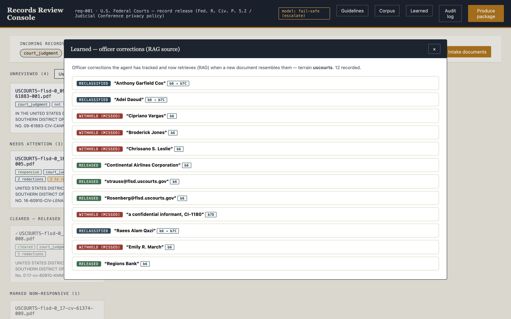
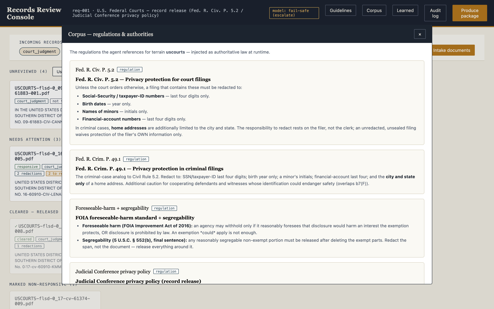

# FOIA Triage & Redaction Agent

An AI agent that helps a government records officer answer a public-records request. It reads a
set of documents, decides which are **responsive** to the request, proposes **redactions** under
the correct statutory exemptions, learns from the officer's corrections, and assembles a
defensible release package — **without ever making the final disclosure decision itself.**

It runs on **real, born-digital U.S. federal court records** (from GPO's govinfo), needs **no API
key** (the model transport is your logged-in **Claude Code** CLI), and boots already-populated so
you can see the whole workflow in one screen.



<sub>The officer's desk, mid-shift: untouched intake on the left, agent-triaged documents awaiting
review, and cleared / withheld on the right. (The "model: fail-safe" badge is the calibrated-refusal
default — it reads **model: live** when Claude Code is logged in.)</sub>

---

## Why this is useful

**The reviewer's job today is to *hunt*. This flips it to *confirm*.**

A FOIA officer responding to a request may face hundreds or thousands of pages. For each one they
must decide *is this even responsive?*, then read every line hunting for things that must be
withheld — SSNs, home addresses, a private third party's name, a confidential informant, a
pre-decisional recommendation — and justify each call against a statute. It is slow, it is
repetitive, and **the catastrophic failure is silent**: releasing a citizen's SSN throws no error
and looks exactly like a finished job.

This system inverts that. Documents arrive **untouched**. The agent triages responsiveness and
lays down *proposed* redactions, each tagged with its exemption, statutory basis, the detector
that found it, a confidence, and a rationale. The officer's job becomes **review, not search**:
glance, confirm or prune, and release — with a complete audit trail generated for free. The value
isn't "AI finds PII"; it's **collapsing the officer's time-per-document while making the dangerous
miss structurally hard.**

**Why it's built to be *deployable*, not just a demo.** In this domain an over-confident or
unauditable agent isn't a rough edge — it's a non-starter. So the reliability *is* the product:

- it **can't release anything on its own** (the gate fails closed),
- it **degrades safely** to "ask a human" whenever it's unsure or the model is unavailable,
- the **safety-critical PII is caught by deterministic code, not a model**,
- **every action is an auditable record** (FOIA determinations are appealable), and
- it **retargets to a new record domain by editing one config file** — no code change.

It also **learns**: when the officer removes, adds, or reclassifies a redaction, that correction
is tracked and **retrieved at runtime** the next time a similar document comes through.

---

## What you see (the demo)

The console boots **in medias res** — a records officer's desk mid-shift — so the workflow reads at
a glance. Documents are organized into four lanes:

| Lane | Meaning |
| --- | --- |
| **Unreviewed** | raw court PDFs, untouched — select any and click *Run agent* to triage them |
| **Needs attention** | the agent triaged these and proposed redactions; awaiting the officer |
| **Cleared — released** | officer marked responsive; redactions applied |
| **Marked non-responsive** | officer excluded from the release |

Click any card to open a full-screen review modal: the document text with proposed redactions
**highlighted**; hover a highlight to see its exemption type; click one to reclassify (b6 / b5 / b4
/ b7C / b7D / b7E / b7F) or delete it; drag-select any text to add your own. *Mark as responsive*
flashes every redaction to black and applies them; *Produce package* runs the fail-closed release
gate.



<sub>Reviewing a habeas order: the agent flagged the private petitioner's name (hover shows the
exemption type), while leaving the magistrate judge and counsel of record released. The right panel
carries the exemption, statutory basis, the detector that found it, and a confidence — reclassify,
delete, or mark the document below.</sub>

Three panels expose the agent's reasoning aids — and they're the *same* content the agent reads at
runtime:

- **Guidelines** — how we redact (editable rule files) + worked before/after examples.
- **Corpus** — the regulations the agent references for the terrain (the court demo shows FRCP
  5.2 / 49.1, the Judicial Conference privacy policy, foreseeable-harm/segregability, and the
  e-filing remote-access policy; the federal profile carries the FOIA §552(b) schedule and the
  Privacy Act).
- **Learned** — the officer corrections the agent has tracked and now RAGs against.
- **Audit log** — the full administrative record of every action.

| Learned — corrections the agent RAGs against | Corpus — the regulations it references |
| :---: | :---: |
|  |  |

---

## Quick start

**Prerequisites**

- **Python 3.10+**
- **[Claude Code](https://claude.com/claude-code) installed and logged in** — this is the model
  transport (no API key needed). Verify with `claude --version` and that you're signed in.
- *(optional)* **poppler** (`pdftotext`) for best PDF extraction; a pure-Python fallback (`pypdf`)
  is installed automatically, so this is not required.

**Run it — one command:**

```bash
./run.sh
```

That sets up a virtualenv on first run, seeds the reference layer, prints the deterministic safety
metric, and serves the console at **http://localhost:8000** (it also opens your browser on macOS).
The console boots already-populated.

### Starting it from Claude Code

The agent's judgment layer **shells out to your logged-in Claude Code CLI** (`claude -p … --output-format json`,
model `claude-sonnet-4-6` by default), so run it in an environment where Claude Code is
authenticated. If you're driving this *with* Claude Code (or any agent/CI), here's the exact
sequence and how to verify it's live:

```bash
# 1. first-time setup + launch (backgrounded so you can poll it)
./run.sh &

# 2. wait for the server, then check it's up
until curl -sf http://localhost:8000/api/status >/dev/null; do sleep 1; done
echo "console up at http://localhost:8000"

# 3. confirm the live model transport is wired (badge in the UI shows "model: live")
#    — the agent runs even WITHOUT it, deferring every judgment call to a human.
```

Manual equivalent (no `run.sh`):

```bash
python3 -m venv .venv && .venv/bin/pip install -r requirements.txt
.venv/bin/python -m backend.context_layer seed
FOIA_PROFILE=uscourts .venv/bin/uvicorn backend.app:app --reload --port 8000
```

**No Claude Code / no key?** Nothing breaks. The deterministic safety layer, the console, and the
fail-closed gate all run; every model judgment simply **escalates to the officer** (safe
degradation, by construction). Force this path explicitly with `FOIA_DISABLE_MODEL=1`.

**Validate everything works:**

```bash
python -m tests.run            # 15-test harness: units + API integration, no model, no pytest
python -m evals.eval           # the headline safety metric (PII recall), key-free
```

---

## How it works

### Two layers, by design

1. **Deterministic detectors (the safety-critical class).** SSNs, home addresses, personal phones,
   contextual DOBs, account/EIN, passport / driver's-license / alien-registration numbers, inmate
   numbers, credit cards, IPs — found by regex, **not a model**. You do not put a stochastic system
   as the only thing between a private identifier and a public release. Tuned to **over-catch**: a
   false negative is an unlawful disclosure, a false positive is one click for the officer.
2. **The LLM judgment layer (what a regex can't decide).** Responsiveness, and the *contextual*
   exemptions — telling a private litigant apart from a judge or counsel of record, spotting a
   confidential source, a deliberative recommendation, a quasi-identifier. This is a **multi-agent
   orchestration**, not one call.

### The orchestration

A deterministic orchestrator fans each document out to **capability-scoped agents** and a
deterministic reconciler cross-checks them:

- **responsiveness agent** — is the document responsive to the request?
- **privacy agent (b6)** — contextual personal privacy a regex can't catch
- **deliberative agent (b5)** — pre-decisional / attorney-client / work product
- **law-enforcement agents** — investigative technique (b7E), confidential source (b7D),
  physical safety (b7F)
- **reconciler** — deterministic QA: escalates on any agent's non-determination, and on the
  *silent-residue* case (a doc called non-responsive that still holds PII)

Two choices make this deployable rather than a parlor trick: each specialist is **scoped to one
exemption**, so a misfire is bounded to "misjudged its one thing"; and the **control plane and the
safety gate are deterministic code, not a model** — you don't put a stochastic system in charge of
*whether* records get released or in charge of the net that checks it.

### The release gate fails closed

The agent only ever produces *proposed* redactions. `produce` returns **409 and releases nothing**
while any escalation is unresolved or any redaction on a releasable document is still unreviewed —
it physically cannot dribble out partially-reviewed text. (This was found failing *open* in
integration testing and is now guarded by an end-to-end test.)

### Three support layers — the agent's reasoning aids

All three are viewable in the console **and** injected into the model's prompt at runtime:

- **Corpus** — the authoritative regulations for the terrain (the law the agent references).
- **Guidelines** — the operating rules (how to apply the law), plus worked examples.
- **Learned (corrections-RAG)** — every officer correction (a redaction **removed**, **added**, or
  **reclassified**) is logged with its text. When a new document comes in, the agent retrieves the
  past corrections whose distinctive words overlap it and weighs them. Closes the loop
  *feedback → learn → better proposal* with no retraining step — lexical, deterministic, zero new
  dependencies.

### Generalist: terrain is configuration, not code

A **terrain profile** (one YAML) fully describes a deployment — the exemption schedule, the
escalation threshold, the deterministic `detectors:`, and the scoped LLM `specialists:`. The live
demo runs `policy/uscourts.yaml` (federal court records); `policy/foia_federal.yaml` is the agency
default; `policy/echr_anonymization.yaml` retargets the *same* pipeline to European court-record
anonymization. Select with `FOIA_PROFILE=<name>`. A bad regex in a profile is skipped (not fatal);
an omitted section falls back to the federal default, so the safety baseline can never silently
vanish.

### Everything is provenance

Each redaction carries its exemption, statutory basis, rationale, detector, and confidence; every
officer action (intake, run, decision, reclassify, resolve, produce) is written to the audit log.
FOIA determinations are appealable — this is the administrative record, not telemetry.

---

## What's in the box

```
backend/
  detectors.py     deterministic PII detectors (safety-critical layer); patterns from the profile
  agents.py        orchestration: responsiveness + scoped exemption specialists + reconciler
  llm.py           single fail-safe transport (Claude Code CLI or API key; None -> escalate)
  pipeline.py      PDF/text intake (read_doc) + drives the orchestrator; assembles the package
  exemptions.py    terrain-profile loader (FOIA_PROFILE) + quote->offset resolution
  classifier.py    deterministic document-type sorter (drives the health monitor)
  context_layer.py Corpus (regulations) + Guidelines, by (profile, exemption), injected at runtime
  memory.py        corrections-RAG (recall_corrections) + aggregate caveats
  feedback.py      officer-decision stream -> error rates + the corrections RAG learns from
  health.py        per-type health monitor; auto-opens a profile review on failure
  registry.py      versioned profile registry (promote / rollback)
  runtime.py       shared state + primitives; intake.py / seeding.py; api_models.py
  app.py           FastAPI routes: intake, run, review, reclassify, resolve, produce (fails closed)
console/           single-page review console (index.html + styles.css + app.js, served no-cache)
policy/            terrain profiles: uscourts.yaml (live demo), foia_federal.yaml, echr_*.yaml
context/files/     the Corpus + Guidelines markdown (materialized + injected per terrain)
evals/             accuracy + scale harnesses (below) and the promotion scorecard
tests/             the end-to-end test harness (python -m tests.run)
data/pdfs/         the curated live corpus (real born-digital USCOURTS court records)
docs/              ARCHITECTURE · DESIGN_DECISIONS (ADR log, DD-001..018) · RUNBOOK
```

---

## Validate it

```bash
python -m tests.run                              # 15 tests: units + API e2e; no model, no pytest
python -m evals.eval                             # safety-critical PII recall (key-free)
FOIA_PROFILE=uscourts python -m evals.eval_detectors   # court-tuned detectors: recall + precision
FOIA_PROFILE=uscourts python -m evals.scale_pdfs       # process the real court-PDF corpus
python -m evals.eval_pii                         # scale recall vs AI4Privacy (needs `datasets`)
```

**What's measured (and honestly):**

| Check | Result |
| --- | --- |
| PII recall (safety-critical, synthetic gold) | **7/7 = 100%**, zero misses |
| Court-tuned detectors (labeled fixture) | recall **14/14**, precision **15/15** (0 false positives) |
| Universal formats on AI4Privacy 200k | email **100%**, IPv4 **99.8%** |
| US/brand-specific formats (by design) | phone 45% · SSN 28% · card 15% — court-precision trade-off |
| Release gate | fails closed; e2e test proves 0 leaks of unreviewed text |
| Support layers (ablation) | help only where the model errs — gray-zone recall 75% → **100%** |
| Test harness | **15/15 passing** |

The headline metric is **recall on private-individual PII**, reported first and with every miss
named — because one miss is a disclosure incident, not a percentage point. (The first detector
pass scored 5/7; the eval caught two phone formats the patterns missed. That's the argument: you
don't ship a redaction agent on vibes — you measure the failure that matters and gate on it.)

---

## The corpus

The live documents are **real, born-digital U.S. federal court records** from GPO's govinfo
(USCOURTS collection) — orders, R&Rs, habeas dispositions — curated to short, modern, text-layer
PDFs (no 30-year-old scans). They're already public record, so the demo redacts genuinely-public
text and never republishes private PII. The vivid raw-identifier showcase (SSN/DOB/address) lives
in the synthetic, harm-free **Guidelines** examples. `evals/scale_pdfs.py` processes a 100-doc set
in ~2s (54 docs/s).

---

## Honest scope

- **The deterministic layer, pipeline, console, audit trail, fail-closed gate, evals, and test
  harness are real and run now**, with or without a model.
- **The LLM judgment layer needs Claude Code (or a key)**; its accuracy depends on that plus a
  larger labeled set than ships here. The support layers measurably help **only where the strong
  model already errs** — on clear cases they (correctly) add nothing.
- **The corrections-RAG is lexical** — it generalizes by *recurring entity/span*, not abstract
  rule; an embedding backend could slot behind the same seam later.
- **Federal court filings are deliberately PII-light** (FRCP 5.2 pre-redaction), so the value on
  this corpus is the contextual + responsiveness layers, not raw-identifier volume.
- A production deployment would expand the exemption schedule further and add a redaction
  **burn-in** step for produced PDFs (today `produce` returns redacted text + a Vaughn-style log).

**Docs:** [Architecture](docs/ARCHITECTURE.md) · [Design decisions](docs/DESIGN_DECISIONS.md)
(ADR log, DD-001…018) · [Runbook](docs/RUNBOOK.md) (add a terrain, promote/rollback, feedback &
memory).

## License

[MIT](LICENSE) — free to use, modify, and distribute.
